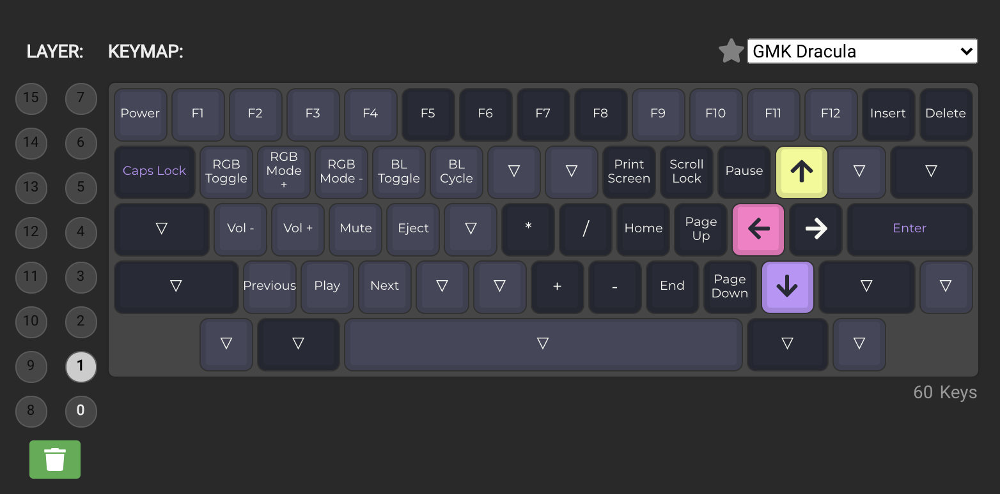

# tokyo60-keymap

Customized Tokyo60 Keyboard Keymap with QMK. Add media control with <kbd>fn+z</kbd>, <kbd>fn+x</kbd>, and <kbd>fn+c</kbd>.

## Changelog

- `fn+z` : Prev
- `fn+x` : Play/Stop
- `fn+c` : Next

## Usage

- Download [latest realeased QMK Toolbox](https://github.com/qmk/qmk_toolbox/releases/) and [tokyo60_layout_channprj.hex](./firmware/tokyo60_tokyo60_layout_channprj.hex)
- Open QMK Toolbox and open local file with [tokyo60_layout_channprj.hex](./firmware/tokyo60_tokyo60_layout_channprj.hex)
- Select **atmega32u4** (Tokyo60 microcontroller)
- Set boot loader mode
- Flash!

# Reference

- https://github.com/qmk/qmk_toolbox
- https://config.qmk.fm/#/
- https://config.qmk.fm/#/tokyo60/LAYOUT_60_hhkb
- https://github.com/davidfriar/tokyo60ispflashing
-
